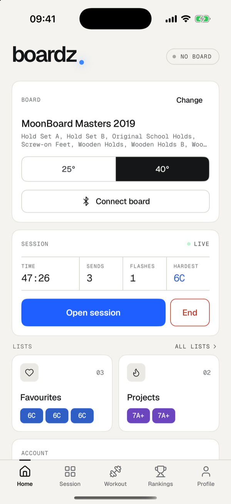
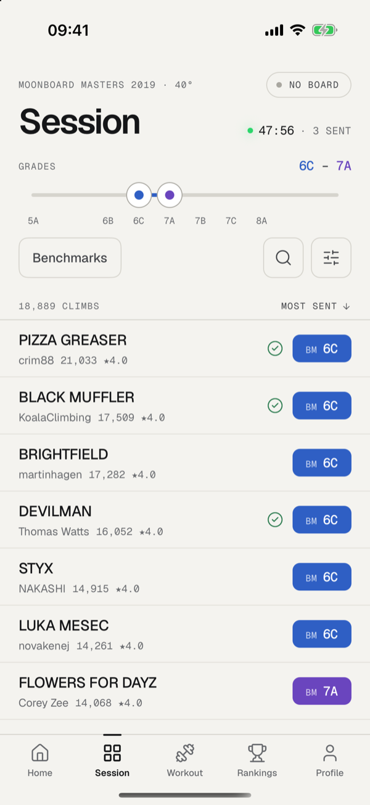
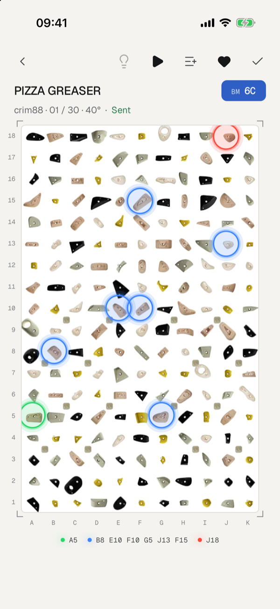
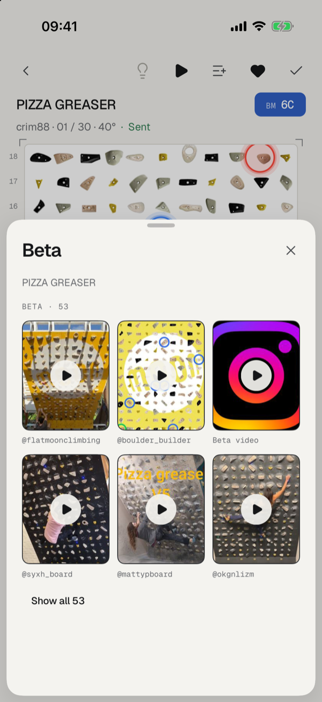
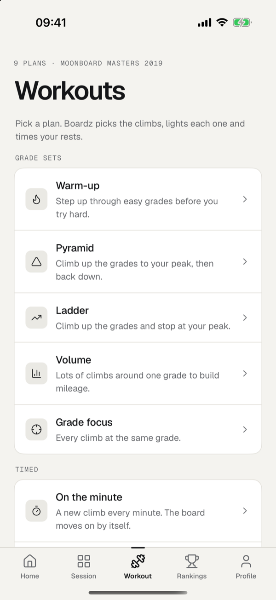
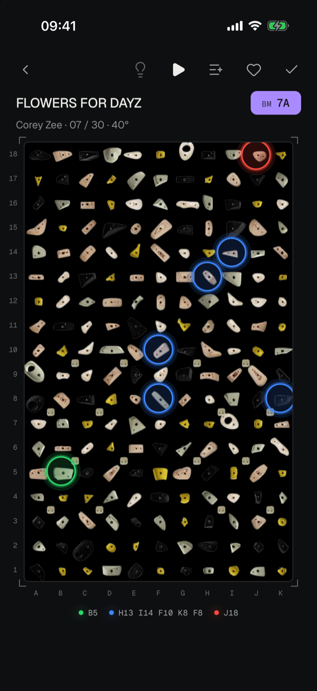

<h1 align="center">Boardz</h1>

<p align="center">
  <strong>A simpler app for LED climbing boards, without the social network attached.</strong><br>
  For iPhone. Works with MoonBoard, Tension, Kilter, Decoy, Grasshopper, So iLL, Touchstone and Woods boards.
</p>

<p align="center">
  
  
  
</p>

## The promise

Board apps keep adding social features: feeds, comments, followers, live group sessions, shared queues. None of that helps when you're standing under the wall between attempts.

Boardz is the other way round. It's a much simpler interface for climbing boards, with nothing that doesn't help you climb:

- It opens on your board. Set a grade range, tap a problem, and it's lit on the wall.
- While you climb, the whole screen is the board. Nothing scrolls, nothing moves, and a swipe takes you to the next problem.
- There are five tabs and no feed, comments, followers or party mode.
- It's about 13,000 lines of code. Boardsesh's mobile app, which Boardz is forked from, is about 235,000.

## Screens

<table>
  <tr>
    <td align="center" width="33%"></td>
    <td align="center" width="33%"></td>
    <td align="center" width="33%"></td>
  </tr>
  <tr>
    <td align="center"><b>Home</b><br>Your board, the session clock and your lists.</td>
    <td align="center"><b>Session</b><br>Drag a grade range. The header counts what's left.</td>
    <td align="center"><b>Climbing</b><br>The board fills the screen. Swipe for the next one.</td>
  </tr>
  <tr>
    <td align="center"></td>
    <td align="center"></td>
    <td align="center"></td>
  </tr>
  <tr>
    <td align="center"><b>Beta</b><br>Videos for the climb, your angle first.</td>
    <td align="center"><b>Workouts</b><br>Nine plans, with climbs picked for you.</td>
    <td align="center"><b>Dark mode</b><br>The board keeps its LED colours.</td>
  </tr>
</table>

## What you can do

- **Light and log.** Tap the bulb to light a problem on your board over Bluetooth, and the tick to log a flash, a send or your attempts. Your logbook is your Boardsesh logbook.
- **Find problems.** Filter by grade range and benchmarks, and search climb names and setters. Grades are colour-coded, and benchmarks carry a BM tag.
- **Train.** Warm-up, pyramid, ladder, volume and grade focus pick climbs by grade. On the minute, 4x4 and limit bouldering run on a timer. Boardz lights each climb in turn and counts down your rests.
- **Keep lists.** The heart saves a problem to Favourites. Projects and your own lists sit one tap away, on Home.
- **Watch beta.** Every climb's beta videos, with the ones filmed at your angle first.
- **See how you're doing.** Rankings for your wall, and a profile with your totals, top grades, grade pyramid and climbing calendar.

## Status

Boardz is a personal project. It runs on iPhone, it isn't on the App Store, and you build it yourself with Xcode. The Bluetooth code follows Boardsesh's own encoders, but it hasn't been tried on every kind of board yet, so check it on yours.

## Build it

The app lives in [`packages/boardz`](../packages/boardz). Its [README](../packages/boardz/README.md) has the full steps, including signing with a free Apple ID. In short, with Xcode and CocoaPods installed:

```bash
curl -fsSL https://vite.plus | bash   # the vp toolchain Boardsesh uses
vp install
echo "BOARDZ_IOS_BUNDLE_ID=com.yourname.boardz" > packages/boardz/.env.local
vp run ios:boardz:release             # builds and installs Boardz on your iPhone
```

To work on the code, `vp run ios:boardz` installs a second app, Boardz Dev, which loads its code from the dev server (`vp run dev:boardz`), so changes appear on the phone as you save. `vp run typecheck:boardz` and `vp run test:boardz` check your work.

## Built on Boardsesh

Boardz is an independent fork of [Boardsesh](https://github.com/boardsesh/boardsesh). It reuses Boardsesh's open-source board catalogue, Bluetooth encoders, climb search and workout generator, and it signs in to the Boardsesh service, so your logbook is the same in both apps. It isn't made or endorsed by Boardsesh, Aurora Climbing, Moon Climbing or any board maker.

This repository is Boardsesh's monorepo with Boardz added. Boardz is entirely in `packages/boardz`. Everything else is Boardsesh as it is upstream, apart from a few lint and formatting settings, so Boardsesh's fixes to the shared code arrive with a plain merge. The README at the repository root is Boardsesh's own. Here, GitHub Actions is switched off, and Boardsesh's Dependabot config, sponsor link and code owners are removed, since they belong to Boardsesh's project.

To pull in Boardsesh's latest changes:

```bash
git remote add upstream https://github.com/boardsesh/boardsesh.git   # once
git fetch upstream
git merge upstream/main
```

The usual conflict is `pnpm-lock.yaml`: take Boardsesh's copy with `git checkout --theirs pnpm-lock.yaml`, then run `vp install` to add Boardz back. If a merge brings back `.github/dependabot.yml`, `.github/FUNDING.yml` or `.github/CODEOWNERS`, delete them again. Finish with `vp run typecheck:boardz` and `vp run test:boardz`; between them they catch any shared code or backend query that changed.

Boardz uses Boardsesh's hosted API at `ws.boardsesh.com` and signs in with Boardsesh accounts, email and password only. That service is run and paid for by the Boardsesh team. If Boardz is useful to you, you can [sponsor Boardsesh](https://github.com/sponsors/boardsesh).

## Licence

Apache License 2.0, the same as Boardsesh: see [LICENSE](../LICENSE). Boardsesh's code belongs to its contributors, and every change made for Boardz is in this repository's history. MoonBoard, Kilter, Tension, Decoy, Grasshopper, So iLL, Touchstone and Woods are their owners' names, used here only to say which boards Boardz works with. The screenshots show public climbs from the Boardsesh catalogue.
